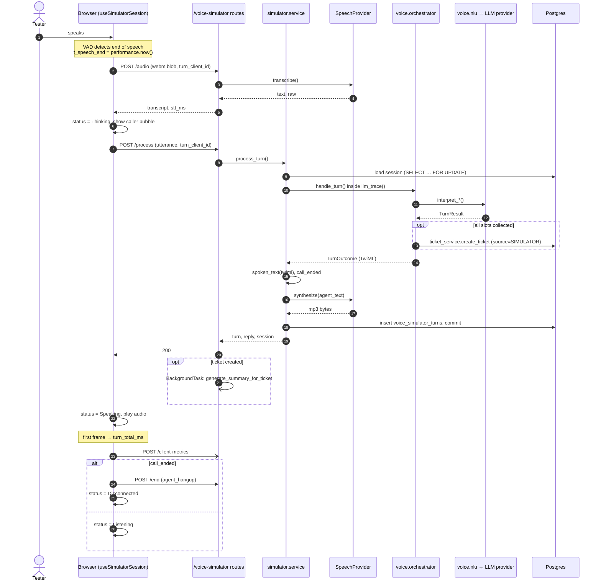
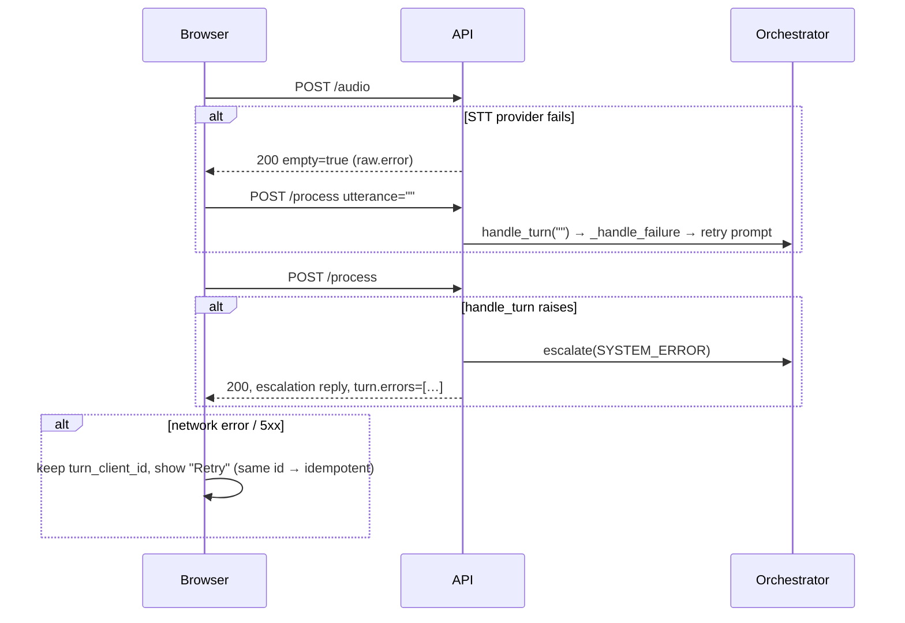
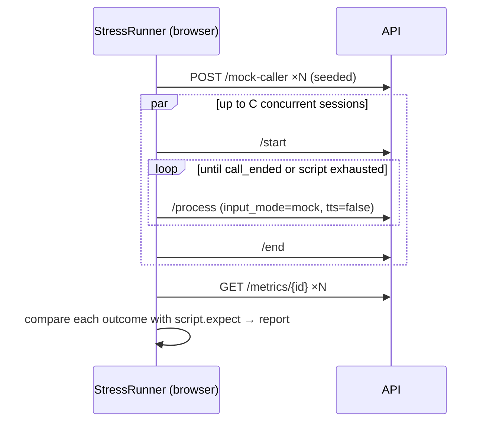

# AI Call Simulator — Design

**Status:** Implemented on `feature/voice-simulator` (2026-09-28). This document is the design as approved; **§11 lists every place the build departed from it and why.** For how to run, operate and test it, see [VOICE_SIMULATOR.md](VOICE_SIMULATOR.md).
**Audience:** engineers building the simulator, QA, and the reviewers approving it.
**Read first:** [CALL_FLOW.md](CALL_FLOW.md) (the state machine) and [VOICE_AGENT_DESIGN.md](VOICE_AGENT_DESIGN.md) (NLU and prompts). This document assumes both.

The simulator is a browser page that lets you "phone" the help desk agent with your microphone and hear it answer, without Twilio. It exists so developers, QA, and stakeholders can test intake end to end, and see where every turn spends its time.

---

## 0. Decisions that shape everything else

These are the calls this design makes. Where one departs from the original request, the reason is given.

| # | Decision | Why |
|---|---|---|
| D1 | **The simulator drives the existing orchestrator (`app/voice/orchestrator.py`). It adds no new agent, prompt, or conversation logic.** | The request asks to "not duplicate AI logic". The orchestrator already *is* the agent: intake only, fixed scripts, no troubleshooting, and `nlu.py` for classification and priority. A free-form LLM agent would test something that never answers a real call. |
| D2 | "LLM processing" means **one `orchestrator.handle_turn()` call**. That covers all NLU calls, validation, state transition, and ticket creation. | That is the work the phone path does between hearing the caller and speaking. The debug panel breaks it down per NLU call (D6). |
| D3 | **STT and TTS are new** and sit behind a `SpeechProvider` protocol modelled on `app/llm/base.py`. The first implementation is OpenAI. | The platform has no STT/TTS today: Twilio's `<Gather>` and Polly do both. There is nothing to reuse. |
| D4 | **Simulator STT/TTS latency does not predict production latency.** The UI says so next to those two numbers. | Production uses Twilio speech recognition and Polly voices, while the simulator uses OpenAI audio models. The LLM stage *is* representative, because it runs the same code with the same timeouts. |
| D5 | Sessions are stored as ordinary `voice_call_sessions` rows flagged `is_simulated`. Tickets are real, with a new source, `SIMULATOR`. | Reusing the row means `record_turn`, `update_collected`, escalation, and ticket creation work unchanged. Real tickets prove creation actually works. The flag and source keep them out of the queue, the Calls page, and analytics. |
| D6 | Raw LLM output is captured by a **context-variable trace** in the LLM provider, not by changing `nlu.py` signatures. | Keeps the production path untouched. It is a no-op when no trace is active. |
| D7 | Every stage has a **typed-text path** alongside audio. | Stress tests, mock callers, replay, and CI can't use a microphone. It also isolates NLU bugs from STT bugs. |
| D8 | Endpoints live under **`/api/v1/voice-simulator/...`**, not `/api/voice-simulator/...`. | Every existing route is under `/api/v1` (`app/api/v1/router.py`). |
| D9 | The whole feature is **off unless `ENABLE_VOICE_SIMULATOR=true`**, and refuses to enable when `ENVIRONMENT=production`. | The API has no authentication (ARCHITECTURE.md, "no auth"). Unguarded, these endpoints let anyone on the network spend OpenAI credit and create tickets. |
| D10 | "Replay" re-runs a session's caller utterances against a **fresh session** and diffs the outcome. It does not replay audio. | Re-running is a regression test: did the same caller get the same category, priority, and ticket? Replaying stored audio proves nothing, and storing audio raises PHI retention questions (§4.4). |
| D11 | The simulator does **not send notification email by default**. A per-session toggle turns it on. | Test tickets should not email `helpdesk@hfmg.net`. The AI summary *does* run, because the request asks to exercise summary generation. |

**Out of scope for v1:** barge-in (the caller interrupting the agent), streaming STT with partial results, WebRTC or WebSocket transport, and multi-user shared sessions. §9 lists where each would plug in.

---

## 1. Implementation plan

Five phases. Each ends in something demonstrable and merges on its own.

**Phase 1 — Backend foundation (text only).** Migration (§4); `app/simulator/` package with session service and the `start` / `process` / `end` / `session` / `metrics` endpoints; `SIMULATOR` ticket source; `is_simulated` filters on calls, tickets, and analytics; LLM trace (D6); feature gate (D9); tests. *Demo:* a full intake over `curl` with typed utterances, producing a `SIMULATOR` ticket.

**Phase 2 — Frontend shell (text only).** `/voice-simulator` route and nav entry; session state machine hook; conversation timeline; live ticket preview; debug panel; text input. *Demo:* the full intake in the browser by typing.

**Phase 3 — Audio.** `SpeechProvider` protocol and OpenAI implementation; `/audio` endpoint; TTS in `/process`; mic capture, push-to-talk, continuous mode with VAD, waveform, level meters, audio playback. *Demo:* the full intake by voice.

**Phase 4 — Latency.** Client timing capture; `client-metrics` endpoint; latency panel with current/average/max and trend charts. *Demo:* per-stage timings for every turn.

**Phase 5 — Testing tools.** Exports; mock caller library; random issue generator; replay with diff; stress test runner. *Demo:* 20 scripted callers run concurrently, with a pass/fail report.

---

## 2. Backend architecture (FastAPI)

### 2.1 Module layout

```
backend/app/
  simulator/                      NEW — everything simulator-specific
    __init__.py
    routes.py                     Thin HTTP layer, gated by require_simulator_enabled
    service.py                    Session lifecycle; calls the orchestrator; records timings
    timing.py                     StageTimer context manager (perf_counter based)
    schemas.py                    Pydantic request/response models (§3)
    mock_callers.py               Scripted callers + random issue bank (Phase 5)
  speech/                         NEW — STT/TTS, provider-agnostic like app/llm
    base.py                       SpeechProvider protocol
    openai_speech.py              OpenAI transcription + speech synthesis
    factory.py                    get_speech_provider()
  llm/
    trace.py                      NEW — contextvar trace of structured()/text() calls
    openai_provider.py            CHANGED — appends to the trace when one is active
  voice/
    orchestrator.py               CHANGED (one line) — ticket source comes from the session
  services/
    voice_call_service.py         CHANGED — excludes is_simulated rows
    ticket_service.py             CHANGED — default list excludes SIMULATOR source
    analytics_service.py          CHANGED — excludes SIMULATOR source
  core/config.py                  CHANGED — simulator + speech settings (§2.6)
```

`app/simulator` depends on `app/voice`, and never the other way around. The only orchestrator change is D5's ticket source line.

### 2.2 How a turn runs without Twilio

The orchestrator returns `TurnOutcome.twiml`, an XML string. The simulator turns it back into plain words and an end-of-call flag:

```python
# app/simulator/service.py (sketch)
outcome = await orchestrator.handle_turn(db, session, utterance=text, confidence=stt_confidence)
agent_text = orchestrator._extract_spoken_text(outcome.twiml)   # promote to a public helper
call_ended = "<Hangup" in outcome.twiml
```

Promote `_extract_spoken_text` to a public `spoken_text(twiml)` in `app/voice/twiml.py`. It is now part of two callers' contracts, and it keeps the simulator away from private names.

Session identity: `twilio_call_sid = "SIM-" + uuid4().hex`, `from_number = "simulator"` (fails `caller_id_is_usable`, so the agent asks for a phone number exactly as it would for a withheld caller ID). A start option, `caller_id`, lets QA test the "caller ID present, skip the phone question" path.

Post-ticket work mirrors `voice/routes.py::_dispatch_ticket_tasks`. Summary generation always runs as a `BackgroundTask`; email runs only if the session was started with `send_notifications=true` (D11).

Error handling mirrors `gather()`: if `handle_turn` raises, call `orchestrator.escalate(..., SYSTEM_ERROR)`, and record the exception in the turn's `errors` with its type and message. The UI shows the agent's escalation message *and* the error in the debug panel. That is exactly what a real caller would have heard.

### 2.3 Timing

```python
# app/simulator/timing.py
class StageTimer:
    """Records start/end for one named stage as perf_counter deltas from turn start."""
```

Server timestamps are `time.perf_counter()` offsets from the moment the request arrived, in milliseconds. Browser timestamps are `performance.now()`. **The two clocks are never compared.** Only durations cross the network (§5.3).

### 2.4 LLM trace (debug panel data)

```python
# app/llm/trace.py
@dataclass
class LLMCall:
    kind: Literal["structured", "text"]
    schema_name: str | None
    started_ms: float
    duration_ms: float
    system: str
    user: str
    output: dict | str | None       # None on failure
    error: str | None
    attempts: int

_current: ContextVar[list[LLMCall] | None] = ContextVar("llm_trace", default=None)

@contextmanager
def llm_trace() -> Iterator[list[LLMCall]]: ...
def record(call: LLMCall) -> None:          # no-op when no trace is active
```

`OpenAIProvider.structured()` and `.text()` call `trace.record(...)` in a `finally`. `service.process_turn` wraps `handle_turn` in `with llm_trace() as calls:`. Each NLU call's schema name (`record_issue`, `record_name`, `record_email`, `record_answer`) labels it in the UI.

Recorded prompts contain caller speech. They are stored only on simulator turns (§4.4) and never logged at INFO.

### 2.5 Speech provider

```python
# app/speech/base.py
@runtime_checkable
class SpeechProvider(Protocol):
    name: str
    @property
    def is_configured(self) -> bool: ...
    async def transcribe(self, *, audio: bytes, mime_type: str, language: str,
                         timeout: float) -> Transcription | None: ...
    async def synthesize(self, *, text: str, voice: str, format: Literal["mp3", "opus"],
                         timeout: float) -> bytes | None: ...

@dataclass
class Transcription:
    text: str
    confidence: float | None      # None when the provider does not report one
    language: str | None
    raw: dict                     # provider response, for the debug panel
```

Returns `None` on failure, following the same rule as `LLMProvider`: a failed transcription becomes an empty utterance, which the orchestrator already treats as a misunderstanding. The model names are settings, not code (§2.6).

Browsers record `audio/webm;codecs=opus` (Chrome, Edge, Firefox) or `audio/mp4` (Safari). OpenAI transcription accepts both, so no server-side transcoding is needed.

### 2.6 Settings

```python
# core/config.py additions
enable_voice_simulator: bool = False
simulator_max_audio_bytes: int = 2_000_000          # ~60s of opus; reject larger with 413
simulator_max_turns_per_session: int = 40
simulator_max_concurrent_sessions: int = 20         # caps the stress test
simulator_session_idle_timeout_seconds: int = 600    # sweeper marks ABANDONED
speech_provider: str = "openai"
speech_stt_model: str = "gpt-4o-mini-transcribe"
speech_tts_model: str = "gpt-4o-mini-tts"
speech_tts_voice: str = "alloy"
speech_timeout_seconds: float = 10.0
```

A startup validator raises if `enable_voice_simulator` is true while `environment == "production"` (D9). `GET /settings/status` gains `voice_simulator_enabled` so the frontend can hide the nav entry.

---

## 3. API contracts

Base path `/api/v1/voice-simulator`. Every route depends on `require_simulator_enabled`, which returns **404** when disabled, so a disabled deployment does not advertise the feature. Errors use the existing `{"detail": "..."}` shape.

### 3.1 `POST /start`

Creates a session and returns the greeting.

```jsonc
// request
{
  "caller_id": null,               // string | null — simulate Twilio caller ID (E.164)
  "send_notifications": false,     // D11
  "tts": true,                     // false = text-only session, no audio returned
  "label": "QA: printer happy path" // optional, shown in exports
}
// 201 response
{
  "session": SimulatorSession,     // §7
  "greeting": AgentReply
}
```

`409` when `simulator_max_concurrent_sessions` is reached.

### 3.2 `POST /audio` (multipart)

Speech-to-text only. It is separate from `/process` so the STT result can be shown (and corrected) before it reaches the agent, and so STT time is measured by itself.

```
fields: session_id (uuid), turn_client_id (uuid, idempotency key), audio (file)
```
```jsonc
// 200
{
  "turn_client_id": "…",
  "transcript": "my outlook won't open",
  "confidence": null,
  "empty": false,                  // true if STT heard nothing
  "raw": { … },                    // provider response
  "timings": { "stt_ms": 612.4, "server_ms": 640.1 }
}
```

`413` over the size cap, `415` for an unsupported MIME type, and `503` when the speech provider is not configured. A provider *failure* is not an error: it returns `200` with `empty: true` and the reason in `raw.error`, so the caller hears the normal "sorry, I didn't catch that".

### 3.3 `POST /process`

Runs one agent turn, plus TTS.

```jsonc
// request
{
  "session_id": "…",
  "turn_client_id": "…",           // same id as /audio, or fresh for typed input
  "utterance": "my outlook won't open",
  "input_mode": "voice",           // "voice" | "text" | "mock"
  "stt_confidence": null
}
// 200
{
  "turn": SimulatorTurn,           // §7 — includes reply text, timings, trace
  "reply": AgentReply,             // text + optional base64 audio
  "session": SimulatorSession      // updated collected slots, state, ticket
}
```

**Idempotency:** a repeat `turn_client_id` returns the stored turn and does not re-run it. This matters because the orchestrator's own replay guard only covers ticket creation.

`409` if the session has ended, and `422` if `simulator_max_turns_per_session` is exceeded.

Audio is inline base64 (`reply.audio.base64`, `mime_type: "audio/mpeg"`). A two-sentence reply is about 40 KB, and inlining saves a round trip on the critical path. Audio is not stored (§4.4).

### 3.4 `POST /end`

```jsonc
{ "session_id": "…", "reason": "user_hangup" }   // "user_hangup" | "agent_hangup" | "error" | "cleared"
```

This mirrors `voice/routes.py::call_status`. It sets `ended_at`, and marks the session `ABANDONED` if it is not already terminal. It **runs the same abandoned-call salvage** (`orchestrator.salvage_abandoned_call`) when a description and phone were collected, so QA can test that path by hanging up mid-intake. Returns the final `SimulatorSession`.

### 3.5 `GET /session/{id}`

Returns `SimulatorSessionDetail`: the session, every turn with timings and trace, and the linked ticket (number, status, category, priority, AI summary status). This is what exports and replay read.

### 3.6 `GET /metrics/{id}`

```jsonc
{
  "session_id": "…",
  "turns": [TurnTimings, …],
  "stats": {
    "stt_ms":       { "current": 610, "avg": 580, "max": 902, "p95": 880, "n": 7 },
    "llm_ms":       { … },
    "tts_ms":       { … },
    "playback_ms":  { … },
    "capture_ms":   { … },
    "turn_total_ms":{ … }
  }
}
```

### 3.7 `POST /session/{id}/client-metrics` (addition to the requested list)

The server cannot see capture or playback, so the browser reports them after each turn. This is fire-and-forget: the UI never waits on it.

```jsonc
{
  "turn_client_id": "…",
  "utterance_ms": 2140,            // how long the caller spoke
  "capture_ms": 910,               // end of speech → /audio request sent (VAD hang + encode)
  "upload_ms": 85,                 // network portion not accounted for by server_ms
  "playback_start_ms": 38,         // /process response received → first audio frame
  "playback_duration_ms": 3420,
  "turn_total_ms": 2390            // end of caller speech → first agent audio frame
}
```

### 3.8 `POST /mock-caller` and `GET /random-issue` (Phase 5)

`GET /random-issue?category=Printer&seed=42` returns one utterance from a curated bank (§8.3). `POST /mock-caller` returns a full scripted caller (`MockCallerScript`, §7). Both are deterministic for a given seed, so a failing stress test can be reproduced.

---

## 4. Storage

### 4.1 Changes to existing tables (one Alembic migration)

```sql
ALTER TYPE ticketsource ADD VALUE 'SIMULATOR';
ALTER TABLE voice_call_sessions ADD COLUMN is_simulated boolean NOT NULL DEFAULT false;
CREATE INDEX ix_voice_call_sessions_is_simulated ON voice_call_sessions (is_simulated) WHERE is_simulated;
```

`orchestrator._create_ticket` changes `ticket.source = TicketSource.PHONE` to `TicketSource.SIMULATOR if session.is_simulated else TicketSource.PHONE`.

**Consumers to update, each with a test:**
- `voice_call_service.list_voice_calls` and `get_summary`: exclude `is_simulated`.
- `ticket_service.list_tickets`: exclude `SIMULATOR` unless `source=SIMULATOR` is requested explicitly.
- `analytics_service`: exclude `SIMULATOR` everywhere. Note that `get_tickets_by_source` iterates `TicketSource`, so it must skip the new member or the chart grows a zero bar.
- Frontend `SourceBadge` and the ticket source filter: add `SIMULATOR` (label "Simulator").

### 4.2 New table: `voice_simulator_turns`

Per-turn metrics and debug data. These are relational columns, not JSONB, so `/metrics` is a plain aggregate query.

| column | type | notes |
|---|---|---|
| `id` | uuid pk | |
| `session_id` | uuid fk → voice_call_sessions, on delete cascade | indexed |
| `turn_index` | smallint | 0 = greeting |
| `turn_client_id` | uuid, unique | idempotency key (§3.3) |
| `input_mode` | varchar(8) | voice / text / mock |
| `utterance` | text | what reached the orchestrator |
| `stt_raw` | jsonb, null | |
| `stt_confidence` | real, null | |
| `state_before`, `state_after` | voicecallstate | |
| `agent_text` | text | |
| `call_ended` | boolean | |
| `collected_after` | jsonb | slot snapshot, for the "structured extraction" view and replay diffs |
| `llm_trace` | jsonb | list of `LLMCall` (§2.4) |
| `errors` | jsonb | list of `{stage, type, message}` |
| `stt_ms`, `llm_ms`, `tts_ms`, `server_total_ms` | real, null | server-measured |
| `utterance_ms`, `capture_ms`, `upload_ms`, `playback_start_ms`, `playback_duration_ms`, `turn_total_ms` | real, null | client-reported (§3.7) |
| `created_at` | timestamptz | |

`voice_call_sessions.turns` continues to hold the transcript, written by `record_turn` as now. The new table holds only what is simulator-specific.

### 4.3 In memory

Nothing session-critical lives only in memory, so a backend restart mid-call loses nothing but the call in progress. The concurrency cap (§2.6) is a `COUNT(*)` of open simulated sessions, not an in-process counter. That keeps it correct with more than one worker.

### 4.4 Retention and PHI

Testers will speak realistic details, and some may speak real patient information. Therefore:
- **Audio is never stored,** neither caller nor agent audio.
- A cleanup job deletes simulated sessions, turns, and `SIMULATOR` tickets older than **14 days** (configurable). Until a job runner exists, it runs from the same place as other maintenance scripts. Record it in TECHNICAL_DEBT.md.
- The page shows a one-line notice: "Test environment. Don't use real patient information."

---

## 5. Latency measurement

### 5.1 What each number means

| Stage | Measured by | Start → end |
|---|---|---|
| **Audio capture** | browser | caller stops speaking (VAD) or releases push-to-talk → `/audio` request sent. Includes VAD silence hang time and blob finalize. |
| **STT** | server | provider `transcribe()` call start → return |
| **LLM** | server | `handle_turn()` start → return (all NLU calls, DB work, ticket creation) |
| **TTS** | server | provider `synthesize()` start → return |
| **Playback** | browser | `/process` response received → first audio frame out (`decode` + `start`) |
| **Total turn** | browser | caller stops speaking → first agent audio frame. **The number that matters: how long the caller waits in silence.** |

Network time is derived rather than guessed: `client round trip − server_total_ms`, per request. It is shown in the debug panel, not as its own stage.

`stt_start`/`stt_end` etc. from the request are recorded as offsets on the same per-request clock (§2.3), so the debug panel can draw a waterfall.

### 5.2 Budgets (from the production constraint)

Twilio abandons a webhook at about 15 s, and `voice_nlu_timeout_seconds` is 4 s per NLU call. The latency panel marks turns against these thresholds:

| | Good | Warn | Fail |
|---|---|---|---|
| LLM stage | < 2.5 s | 2.5–4 s | > 4 s (an NLU call probably timed out) |
| Total turn | < 3 s | 3–6 s | > 6 s |

The thresholds are constants in one frontend file (`latencyBudgets.ts`), not scattered through the components.

### 5.3 Clock rules

- The server uses `time.perf_counter()` and the browser uses `performance.now()`.
- Durations cross the network, and timestamps never do.
- Wall-clock `created_at` exists only for ordering and display.

---

## 6. Sequence diagrams

### 6.1 One voice turn



### 6.2 Error paths



### 6.3 Stress test



The stress test runs with `tts: false` and text input, so it measures the agent without paying for audio. A separate "audio loopback" option synthesizes the mock caller's lines with TTS and sends them through `/audio`, which tests STT on known text and reports word error rate.

---

## 7. TypeScript interfaces

`frontend/src/types/voiceSimulator.ts`. Backend Pydantic models in `app/simulator/schemas.py` mirror these field for field.

```ts
import type { Priority } from "./ticket";

export type SimulatorStatus =
  | "idle" | "connecting" | "listening" | "thinking" | "speaking" | "disconnected" | "error";

export type AgentState =
  | "GREETING" | "COLLECT_DESCRIPTION" | "COLLECT_NAME" | "COLLECT_PHONE"
  | "COLLECT_EMAIL" | "CONFIRM_EMAIL" | "CONFIRM_CATEGORY" | "ANYTHING_ELSE"
  | "ESCALATED" | "COMPLETED" | "ABANDONED";

export type InputMode = "voice" | "text" | "mock";
export type ListenMode = "push_to_talk" | "continuous";
export type Confidence = "high" | "medium" | "low";
export type EndReason = "user_hangup" | "agent_hangup" | "error" | "cleared";

export interface CollectedSlots {
  description: string | null;
  short_issue: string | null;
  caller_name: string | null;
  phone_number: string | null;
  email: string | null;
  category: string | null;
  category_confidence: Confidence | null;
  priority: Priority | null;
  impact: string | null;
}

export interface SimulatorTicket {
  id: string;
  ticket_number: string;
  status: string;
  category: string;
  priority: Priority;
  ai_summary_status: "PENDING" | "COMPLETED" | "FAILED" | "SKIPPED";
}

export interface SimulatorSession {
  id: string;
  label: string | null;
  state: AgentState;
  collected: CollectedSlots;
  misunderstanding_count: number;
  escalated: boolean;
  escalation_reason: "CALLER_REQUESTED" | "REPEATED_MISUNDERSTANDING" | "SYSTEM_ERROR" | null;
  ticket: SimulatorTicket | null;
  started_at: string;   // ISO
  ended_at: string | null;
  tts_enabled: boolean;
  send_notifications: boolean;
}

export interface AgentReply {
  text: string;
  call_ended: boolean;
  audio: { base64: string; mime_type: "audio/mpeg" } | null;
}

export interface LLMCallTrace {
  kind: "structured" | "text";
  schema_name: string | null;
  started_ms: number;
  duration_ms: number;
  system: string;
  user: string;
  output: Record<string, unknown> | string | null;
  error: string | null;
  attempts: number;
}

export interface TurnError { stage: "stt" | "llm" | "tts" | "db"; type: string; message: string }

export interface ServerTimings {
  stt_ms: number | null;
  llm_ms: number | null;
  tts_ms: number | null;
  server_total_ms: number;
}

export interface ClientTimings {
  utterance_ms: number | null;
  capture_ms: number | null;
  upload_ms: number | null;
  playback_start_ms: number | null;
  playback_duration_ms: number | null;
  turn_total_ms: number | null;
}

export type TurnTimings = ServerTimings & ClientTimings & { turn_index: number };

export interface SimulatorTurn {
  id: string;
  turn_client_id: string;
  turn_index: number;
  input_mode: InputMode;
  utterance: string;
  stt_confidence: number | null;
  stt_raw: Record<string, unknown> | null;
  state_before: AgentState;
  state_after: AgentState;
  agent_text: string;
  call_ended: boolean;
  collected_after: CollectedSlots;
  llm_trace: LLMCallTrace[];
  errors: TurnError[];
  timings: TurnTimings;
  created_at: string;
}

export interface SimulatorSessionDetail { session: SimulatorSession; turns: SimulatorTurn[] }

export interface StageStats { current: number | null; avg: number | null; max: number | null; p95: number | null; n: number }
export type LatencyStage = "capture_ms" | "stt_ms" | "llm_ms" | "tts_ms" | "playback_start_ms" | "turn_total_ms";
export interface SimulatorMetrics {
  session_id: string;
  turns: TurnTimings[];
  stats: Record<LatencyStage, StageStats>;
}

/** Client-side timeline entry: server turns plus local-only events (errors, retries). */
export type TimelineEntry =
  | { kind: "caller"; turnClientId: string; text: string; at: string; pending: boolean; inputMode: InputMode }
  | { kind: "agent"; turnClientId: string; text: string; at: string }
  | { kind: "system"; text: string; at: string; tone: "info" | "warning" | "error" };

export interface MockCallerScript {
  seed: number;
  persona: string;                      // "Front-desk MA, rushed"
  lines: string[];                      // caller utterances, in order
  expect: { category: string; priority: Priority; escalated: boolean; ticket_created: boolean };
}

export interface ReplayResult {
  source_session_id: string;
  replay_session_id: string;
  diffs: { field: keyof CollectedSlots | "state" | "ticket_created"; before: unknown; after: unknown }[];
}
```

---

## 8. Frontend architecture (React)

### 8.1 Where it plugs in

- **Route:** `/voice-simulator` in `App.tsx`.
- **Navigation:** `navItems.ts`, placed after Calls, and rendered only when `GET /settings/status` reports `voice_simulator_enabled`. DESIGN.md §4 fixes the nav at six items, so update DESIGN.md in the same PR.
- **Data layer:** `api/voiceSimulator.ts` on top of `api/client.ts`. Reads (`session`, `metrics`) use TanStack Query. Turn submission is imperative inside the session hook, not `useMutation`, because the turn is one step of a state machine and not an isolated write.
- **Charts:** Recharts (already a dependency), styled like `components/analytics/ChartCard.tsx`.
- **Theme:** existing `ThemeProvider` tokens. Canvas visualizations read colors from CSS variables at draw time, so dark mode works without a re-render.
- **Toasts:** `lib/toastStore.ts`, for ticket created, errors, and export done.

### 8.2 Component hierarchy

```
VoiceSimulatorPage                          pages/VoiceSimulatorPage.tsx
├─ SimulatorHeader                          title, CallStatusIndicator, session label, PHI notice
│  └─ CallStatusIndicator                   dot + label + aria-live region
├─ SimulatorLayout                          responsive 3-column grid
│  ├─ ConversationTimeline                  left
│  │  ├─ TimelineMessage (caller | agent | system)
│  │  └─ TextUtteranceInput                 typed fallback (D7), Enter to send
│  ├─ CallControlPanel                      center
│  │  ├─ CallButtons                        Start / Mute / Stop / Clear
│  │  ├─ ListenModeToggle                   Push-to-talk ↔ Continuous
│  │  ├─ PushToTalkButton                   hold to talk (pointer + Space)
│  │  ├─ WaveformCanvas                     live mic waveform
│  │  ├─ LevelMeter (source="mic")
│  │  ├─ LevelMeter (source="speaker")
│  │  └─ DeviceSelect                       input device picker
│  └─ TicketPreviewPanel                    right
│     ├─ SlotField ×N                       name, email, phone, issue, category, priority
│     ├─ ConfidenceBadge
│     └─ TicketResultCard                   number, status, AI summary status, link to /tickets?ticket=
├─ LatencyPanel
│  ├─ LatencyStatGrid                       current / avg / max per stage, budget colouring
│  ├─ LatencyTrendChart                     line per stage across turns
│  └─ TurnWaterfallChart                    stacked bar for the selected turn
├─ TestingToolbar
│  ├─ ExportMenu                            transcript .txt, metrics .csv, session .json, ticket .json
│  ├─ MockCallerButton / RandomIssueButton
│  ├─ ReplayButton → ReplayDiffModal
│  └─ StressTestButton → StressTestDrawer (config, progress, results table)
└─ DebugPanel (collapsible, per selected turn)
   ├─ DebugSection "STT"                    stt_raw
   ├─ DebugSection "LLM calls"              LLMCallTrace list: schema, duration, prompt, output
   ├─ DebugSection "Extraction"             collected_after, diffed against the previous turn
   ├─ DebugSection "Classification / Priority"
   ├─ DebugSection "Timings"
   ├─ DebugSection "API calls"              method, path, status, duration (from the api wrapper)
   └─ DebugSection "Errors"
```

Files: `components/voiceSimulator/*`, `hooks/voiceSimulator/*`, `lib/voiceSimulator/*`. The existing `Button`, `Card`, `Badge`, `Drawer`, `Modal`, `StatusIndicator`, `EmptyState`, and `ErrorState` are reused, and new components add only what is missing.

### 8.3 Hooks and state

```
useSimulatorSession()      the state machine — owns status, session, turns, timeline
 ├─ useMicrophone()         getUserMedia, device list, mute, AnalyserNode, permission state
 ├─ useVoiceActivity()      energy-based VAD over the analyser (continuous mode)
 ├─ useRecorder()           MediaRecorder wrapper → Blob + mime type + utterance_ms
 ├─ useAudioPlayer()        decode base64 → AudioBuffer, play, speaker analyser, onFirstFrame
 └─ useApiCallLog()         ring buffer of API calls for the debug panel
useLatencyStats(turns)     derives current/avg/max/p95 per stage (pure; unit-tested)
useSimulatorShortcuts()    keyboard bindings (§8.6)
```

`useSimulatorSession` is a `useReducer` with explicit transitions. Every event not listed is ignored, so a double click can't cause a double submit:

```
idle ──start──▶ connecting ──greeting played──▶ listening
listening ──speech end / PTT release / text submit──▶ thinking
thinking ──/process ok──▶ speaking ──playback end──▶ listening | disconnected (call_ended)
thinking ──/process fail──▶ error ──retry (same turn_client_id)──▶ thinking
any ──stop──▶ disconnected          any ──clear──▶ idle
```

In **continuous mode**, the mic stays open but the recorder is paused while `speaking`. Without barge-in, recording the agent's own voice would feed it back to itself. The VAD defaults are a 0.02 RMS threshold, 250 ms of speech to open, and 800 ms of silence to close. They are adjustable in an "Advanced" popover, because room noise varies.

### 8.4 Wireframes

Desktop (≥ 1280 px):

```
┌──────────────────────────────────────────────────────────────────────────────────────┐
│ AI Call Simulator            ● Listening          "QA: printer happy path"  ⓘ Test env │
├──────────────────────────┬────────────────────────────────┬──────────────────────────┤
│ CONVERSATION             │                                │ LIVE TICKET              │
│                          │        ┌──────────────┐        │ Name      Maria Lopez    │
│ 10:02:14  Agent          │        │   ◉  00:47   │        │ Email     mlopez@hfmg…  │
│ Thank you for calling…   │        └──────────────┘        │ Phone     +1 555 …       │
│                          │   [■ Stop]  [🎙 Mute]  [↺ Clear] │ Issue     Outlook won't  │
│ 10:02:19  You            │                                │           open           │
│ My Outlook won't open    │   ( Push-to-talk | Continuous )│ Category  Microsoft 365  │
│                          │                                │           ●●● high       │
│ 10:02:21  Agent          │  ▁▂▅▇▅▃▂▁▁▂▃▆▇▆▃▂▁  waveform     │ Priority  Medium         │
│ Sorry to hear that…      │                                │ ──────────────────────── │
│                          │  Mic     ▮▮▮▮▮▮▯▯▯▯              │ Ticket    HD-2026-0142   │
│ ┌──────────────────────┐ │  Speaker ▮▮▯▯▯▯▯▯▯▯              │ Status    NEW            │
│ │ Type instead…     ⏎ │ │  [Hold Space to talk]          │ AI summary  Pending…     │
│ └──────────────────────┘ │                                │                          │
├──────────────────────────┴────────────────────────────────┴──────────────────────────┤
│ LATENCY          Capture   STT    LLM    TTS   Playback  │ Total turn                  │
│ current           0.91s   0.61s  1.84s  0.52s   0.04s    │ 3.10s ▲ warn                │
│ avg / max        …                                        │ ┌ trend ───────────────┐    │
│                                                           │ │  ╱╲__╱‾‾╲__           │    │
│                                                           │ └──────────────────────┘    │
├───────────────────────────────────────────────────────────────────────────────────────┤
│ [Mock caller] [Random issue] [Replay] [Stress test]              [Export ▾]            │
├───────────────────────────────────────────────────────────────────────────────────────┤
│ ▸ Debug — turn 3 of 7  (STT · LLM calls (2) · Extraction · Classification · Timings · │
│                         API calls · Errors (0))                                        │
└───────────────────────────────────────────────────────────────────────────────────────┘
```

Tablet (768–1279 px): the call controls span the top, and the conversation and ticket sit side by side underneath. The latency, toolbar, and debug sections stack below.

Phone (< 768 px): a single column, ordered status → controls → conversation → ticket → latency → debug. Push-to-talk becomes a large, full-width hold button. The debug panel is collapsed by default.

### 8.5 Accessibility

- `CallStatusIndicator` owns an `aria-live="polite"` region announcing status changes. New agent messages are announced through the timeline's `role="log"`.
- Every control is a real `<button>` with a text label. Icon-only buttons get an `aria-label`. Mute and push-to-talk use `aria-pressed`.
- Level meters are `role="meter"` with `aria-valuenow`. The waveform canvas is `aria-hidden`, because the meter carries the same information.
- Status is never shown by colour alone: dot plus label, and budget states say "warn" or "fail" in text.
- `prefers-reduced-motion` stops the waveform animation and shows a static level bar instead.
- Mic permission denied → an inline `ErrorState` with browser-specific instructions, and the text input stays usable.

### 8.6 Keyboard shortcuts

Active only when focus is not in a text field. A `?` popover lists them.

| Key | Action |
|---|---|
| `Space` (hold) | Push-to-talk |
| `M` | Mute / unmute mic |
| `Shift+S` | Start call, or stop call if active |
| `Shift+C` | Clear session (asks for confirmation if a call is active) |
| `T` | Focus the text input |
| `D` | Toggle debug panel |
| `L` | Toggle listen mode |

### 8.7 Exports

These are generated client-side from `GET /session/{id}` and `GET /metrics/{id}`, so the export matches what the server recorded, not UI state.

| Export | Format | Contents |
|---|---|---|
| Transcript | `.txt` | Timestamped `Agent:` / `Caller:` lines, same format as `transcript_text()` |
| Metrics | `.csv` | One row per turn, one column per timing field |
| Session | `.json` | `SimulatorSessionDetail` + `SimulatorMetrics` + app version |
| Ticket | `.json` | The created ticket as returned by `GET /tickets/{id}` |

Filenames: `hfmg-sim-<session-short-id>-<yyyymmdd-hhmm>.<ext>`.

### 8.8 Testing tools

- **Random issue:** a curated bank in `app/simulator/mock_callers.py`, with around 10 utterances per voice category, including hard cases (lockout from eCW → Password, "the person at the front desk can't print" → Printer with no escalation, prompt-injection attempts). Utterances are hand-written, not LLM-generated, so they are free, reviewable, and deterministic.
- **Mock caller:** a persona plus ordered lines plus `expect`. The page can "play" one into the current session, with each line posted as `input_mode: "mock"` once the agent finishes speaking.
- **Replay:** creates a new session and sends the source session's caller utterances in order. It shows a `ReplayDiffModal` of slots, state, and ticket outcome. If the conversation diverges (the agent asks something different), replay stops and reports the turn where it diverged.
- **Stress test:** N callers (≤ 50), concurrency C (≤ `simulator_max_concurrent_sessions`), and a seed. It shows live progress and a results table (pass/fail against `expect`, turns, total and p95 LLM time), plus CSV export. It runs text-only unless audio loopback is ticked.

---

## 9. Future extensions (not v1)

- **Barge-in:** needs echo cancellation (`getUserMedia({ echoCancellation: true })` is not enough with speakers), plus cancelling in-flight TTS playback. Plug in at `useAudioPlayer` and the reducer's `speaking` state.
- **Streaming STT / TTS:** a WebSocket at `/voice-simulator/stream` next to the current endpoints. The reducer is already event-driven, so transport can change without UI changes.
- **Twilio-fidelity mode:** once credentials exist, call Twilio's own speech recognition and Polly, so simulator STT/TTS latency becomes representative (retires D4).

---

## 10. Implementation checklist

### Phase 1 — Backend foundation
- [ ] Alembic migration: `ticketsource` += `SIMULATOR`; `voice_call_sessions.is_simulated`; `voice_simulator_turns` table (§4)
- [ ] `VoiceCallSession.is_simulated` + `VoiceSimulatorTurn` models
- [ ] `orchestrator._create_ticket`: source from `session.is_simulated`
- [ ] Promote `_extract_spoken_text` → public `twiml.spoken_text()`; update orchestrator to use it
- [ ] Exclude simulated data: `voice_call_service` (list + summary), `ticket_service.list_tickets` default, all of `analytics_service` (incl. `get_tickets_by_source` enum loop)
- [ ] Settings (§2.6) + production startup guard + `voice_simulator_enabled` in `/settings/status`
- [ ] `app/llm/trace.py` + `OpenAIProvider` records into it; test that it is a no-op without an active trace
- [ ] `app/simulator/timing.py`, `schemas.py`, `service.py`, `routes.py`; register router in `api/v1/router.py`
- [ ] `start`, `process` (text), `end` (incl. salvage), `session`, `metrics`, `client-metrics`
- [ ] Idempotency on `turn_client_id`; `SELECT … FOR UPDATE` on the session row per turn
- [ ] Concurrency cap, max turns, idle-session sweeper
- [ ] Background summary always; email only if `send_notifications`
- [ ] Logging: `hfmg.simulator` logger, one INFO line per turn (`session state_before→state_after llm_ms stt_ms tts_ms errors=n`), no caller text at INFO
- [ ] Tests: full happy path via API; escalation on request; repeated misunderstanding; abandon + salvage; `handle_turn` raising → SYSTEM_ERROR escalation; idempotent replay of a turn; disabled → 404; production guard; simulated rows absent from calls/tickets/analytics
- [ ] API_SPEC.md, DATABASE_DESIGN.md, and CALL_FLOW.md (note the simulator entry point) updated

### Phase 2 — Frontend shell
- [ ] `types/voiceSimulator.ts`, `api/voiceSimulator.ts` (with API call log hook)
- [ ] Route, conditional nav item; DESIGN.md nav section updated
- [ ] `useSimulatorSession` reducer + unit tests for every transition and ignored event
- [ ] Header + `CallStatusIndicator`, `ConversationTimeline`, `TextUtteranceInput`, `TicketPreviewPanel`, `DebugPanel`
- [ ] Loading, empty, and error states for every panel; retry with the same `turn_client_id`
- [ ] `SourceBadge` + ticket filter support `SIMULATOR`
- [ ] Responsive layouts (§8.4), dark mode check, keyboard shortcuts, a11y pass (§8.5)

### Phase 3 — Audio
- [ ] `app/speech/` protocol, OpenAI implementation, factory; `/audio` endpoint with size/MIME limits; TTS in `/process`
- [ ] Tests with a fake `SpeechProvider`: failure → `empty: true` → orchestrator retry prompt
- [ ] `useMicrophone`, `useRecorder`, `useVoiceActivity`, `useAudioPlayer`
- [ ] Push-to-talk and continuous modes; recorder paused while speaking
- [ ] `WaveformCanvas`, `LevelMeter` ×2, `DeviceSelect`, mute
- [ ] Mic permission denied / no device / unsupported MIME handled with text fallback
- [ ] Manual test matrix: Chrome, Edge, Firefox, Safari (desktop); Chrome Android; iOS Safari

### Phase 4 — Latency
- [ ] Client timing capture per §5.1; `client-metrics` post
- [ ] `useLatencyStats` + unit tests (empty, single turn, nulls)
- [ ] `LatencyStatGrid`, `LatencyTrendChart`, `TurnWaterfallChart`; `latencyBudgets.ts`
- [ ] D4 caveat shown beside STT and TTS numbers

### Phase 5 — Testing tools
- [ ] `mock_callers.py` bank + `/random-issue`, `/mock-caller` (seeded) + tests for determinism
- [ ] Exports (§8.7)
- [ ] Replay with divergence detection + `ReplayDiffModal`
- [ ] Stress test drawer, results table, CSV; server-side cap respected; audio loopback with WER
- [ ] Retention cleanup script (§4.4) + TECHNICAL_DEBT.md entry

### Before calling it done (see §11 for what was built)
- [ ] `ENABLE_VOICE_SIMULATOR` documented in DEPLOYMENT_GUIDE.md and `.env.example`, default off
- [ ] Security review of the new endpoints (no auth, cost exposure, PHI)
- [ ] A stakeholder can complete an intake by voice on a stock laptop, with no setup beyond opening the page

---

## 11. Implementation deviations

The checklist in §10 was delivered, except for the items marked **Not done** below. Everything else that differs from §§0–9 is listed here with the reason, discovered while reading the code or measuring the build.

### Changed

| # | Design said | Built | Why |
|---|---|---|---|
| X1 | One new table, `voice_simulator_turns` | Also `voice_simulator_sessions` (label, TTS on/off, email opt-in, end reason, last activity) | The design had nowhere to keep per-session options, and `voice_call_sessions.collected` belongs to the orchestrator |
| X2 | SIMULATOR tickets use normal numbering | `SIM-YYYY-XXXXXXXX`, random | `HFMG-` numbers are count-based: purging old simulator tickets would re-issue numbers still in use, and concurrent load-test tickets would race. Random numbers avoid both and keep test tickets out of the real sequence |
| X3 | Orchestrator sets `source` after creating the ticket | `ticket_service.create_ticket(..., source=)`; the orchestrator passes `SIMULATOR` or `PHONE` | Needed for X2. The phone path behaves identically (still `PHONE`, still `HFMG-` numbers) |
| X4 | `app/llm/trace.py`, LLM calls only | `app/core/trace.py`, LLM calls **and named spans** | The Conversation Inspector's "ticket payload" and the load test's "ticket creation latency" come from a `ticket_create` span in `ticket_service` |
| X5 | TTS inside the turn, before commit | TTS after commit; STT with no transaction open | Otherwise every pooled connection and session lock would be held through provider round trips (0.5–2 s). See the performance report, F2 |
| X6 | `upload_ms` from the browser | Dropped; server-measured `queue_wait_ms` (connection + session lock) and `ticket_create_ms` added | The browser can't separate upload time from server queueing. Queue wait turned out to be the load-test metric that mattered |
| X7 | `/audio` returns the transcript; the browser sends it to `/process` | `/audio` stores the transcript server-side (turn status `transcribed` → `processing` → `completed`); `/process` uses it unless given an override | Keeps STT results server-authoritative, makes retries idempotent across both calls, and still lets a tester fix a mis-transcription |
| X8 | Mock caller = ordered lines | Answers keyed by agent state; `GET /mock-caller` | Ordered lines break as soon as the agent branches (category confirmation, a re-prompt). State-keyed answers stay in step |
| X9 | Stress test up to 50 callers, any concurrency | Presets 1 / 5 / 10 / 25, concurrency ≤ the server cap (30) | Matches the requested load levels; the server cap bounds cost |
| X10 | Dark mode supported | Light only | `ThemeProvider` on this branch pins the whole app to light mode by design. The page uses the app's own classes, so it follows whatever the app does |
| X11 | Intent not in the design | Derived server-side per turn (`report_issue`, `provide_name`, `confirm`, `request_human`, `unclear`, …) | Required by the Conversation Inspector. Derived from the orchestrator's own transition and model output, so it is not a second classifier |
| X12 | Replay any session | Replay only after the call has ended | Avoids two live sessions from one tester racing each other |
| X13 | `timing.py` StageTimer, `useLatencyStats` hook | Inline `perf_counter` deltas; pure functions in `lib/voiceSimulator/latency.ts` | Simpler, and directly unit-testable |

### Added (not in the design)

- **`SIMULATOR_ALLOW_NOTIFICATIONS`** (default false) and **`AudioSizeLimitMiddleware`**, fixes S1 and S2 from the [security review](docs/reviews/VOICE_SIMULATOR_SECURITY_REVIEW.md).
- **Hourly session cap** (`SIMULATOR_MAX_SESSIONS_PER_HOUR`, default 300), to bound cost.
- **`LLM_PROVIDER=fake`**, keyword rules with configurable latency, refused in production. It makes load tests and demos free and repeatable.
- **`DB_POOL_SIZE` / `DB_MAX_OVERFLOW`**, the performance report's F1. Defaults unchanged.
- **`GET /config`** and **`GET /stats`** for capability detection and the observability roll-up.
- **Phone-style silence timeout** (optional, continuous mode), which mirrors Twilio's 6 s `<Gather>` timeout.
- **`twiml.ends_call()`** and HTML-unescaping in `twiml.spoken_text()`. The old private helper left `&amp;` in transcripts.
- **Lazy-loaded page**: a separate 100 KB chunk.
- **Frontend unit tests** run on Node's built-in test runner (`npm test`), so no new dependency.
- `cleared` hang-ups and idle sweeps never salvage a ticket, because a discarded test session isn't an abandoned caller.

### Not done

- **Audio loopback with word error rate** (§8.8 stress test). The load test is text-only.
- **Manual browser test matrix** (§10 Phase 3), the **dark-mode check** (moot, X10) and the **"stakeholder completes an intake by voice"** check. The page has been type-checked, linted, built and unit-tested, and its API was exercised end to end by a live run, but it has **not been opened in a browser**. See VOICE_SIMULATOR.md §4 for the checklist.
